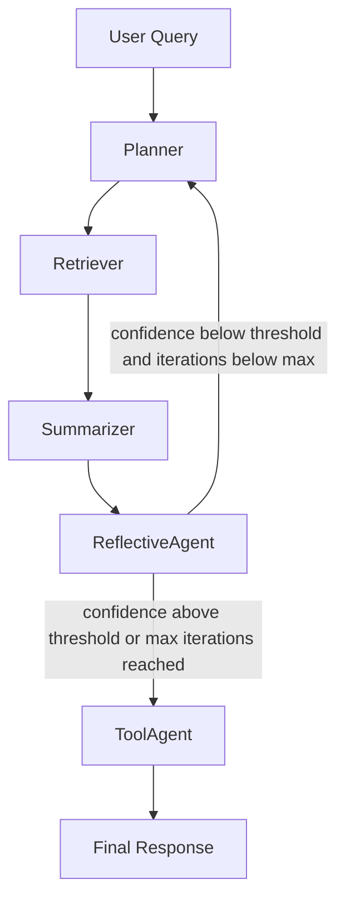

# AI Multi-Agent Math Inquiries

A production-oriented, agentic AI system for mathematical question answering using a Planner-Worker architecture, Retrieval-Augmented Generation (RAG), LLM summarization, reflective evaluation, and optional tool use.

## Project Overview

This project implements an end-to-end multi-agent workflow for answering math-focused queries:

1. Planner interprets intent and sets strategy.
2. Retriever fetches relevant context from ChromaDB.
3. Summarizer generates an answer from retrieved context.
4. ReflectiveAgent evaluates answer quality using LLM-based scoring.
5. ToolAgent optionally calls tools such as symbolic calculator or web search.

The orchestration is implemented with LangGraph and includes an iterative feedback loop when confidence is low.

## Architecture Explanation

### High-Level Flow



### State-Driven Orchestration

The workflow passes a shared state object across all nodes, including:

- `user_query`
- `retrieved_docs`
- `summary`
- `reflection_metrics`
- `tool_results`
- `iteration_count`
- `metadata` (trace, timing, planner decisions)

This makes the system debuggable and easy to extend.

## Agent Roles

### PlannerAgent

- Classifies query type (definition, calculation, proof, research).
- Chooses retrieval breadth (`k`) per iteration.
- Applies feedback-aware re-planning based on reflection confidence.
- Emits routing/tool hints used later by ToolAgent.

### RetrieverAgent

- Queries ChromaDB for top-k relevant chunks.
- Returns ranked context for downstream generation.
- Supports configurable collection and retrieval settings.

### SummarizerAgent

- Uses Mistral (or fallback) to produce concise, context-grounded answers.
- Enforces prompt structure for consistent output quality.

### ReflectiveAgent

- Uses LLM prompt-based evaluation for:
  - factual correctness
  - completeness
  - relevance
- Returns structured JSON metrics and single confidence score in `[0, 1]`.
- Provides actionable feedback text for retries.

### ToolAgent

- Selects tools from registry based on planner hints and query intent.
- Supports built-in tools:
  - Sympy calculator
  - Web search (SerpAPI with DuckDuckGo fallback)
- Easy extension via registry pattern.

## Setup Instructions

## 1) Clone and enter repository

```bash
git clone <your-repo-url>
cd COMP248-AI-MATH-gp
```

## 2) Create virtual environment

### Windows (PowerShell)

```powershell
py -3 -m venv .venv
.\.venv\Scripts\Activate.ps1
```

### macOS/Linux

```bash
python -m venv venv
source venv/bin/activate
```

## 3) Install dependencies

```bash
pip install --upgrade pip
pip install -r prototype/requirements.txt
```

## 4) Configure environment

Create `prototype/.env` from `prototype/.env.example` and set required keys.

Minimum recommended values:

```env
LLM_PROVIDER=openai
OPENAI_API_KEY=your_key_here
OPENAI_MODEL=gpt-4o-mini

# Optional alternatives
MISTRAL_API_KEY=
GEMINI_API_KEY=

# Optional tool integrations
SERPAPI_KEY=
WOLFRAM_ALPHA_KEY=

# Reflection loop controls
CONFIDENCE_THRESHOLD=0.60
MAX_ITERATIONS=3

# ChromaDB / ingestion
CHROMA_DB_DIR=.chroma_db
CHROMADB_COLLECTION_NAME=math_docs
EMBEDDING_MODEL=all-MiniLM-L6-v2
```

## 5) Ingest documents into ChromaDB

```bash
cd prototype
python ingest.py
```

## How to Run

### Streamlit App

```powershell
.\.venv\Scripts\python.exe -m streamlit run prototype/app.py
```

## Deploy on Render (Streamlit)

This repo includes a Render Blueprint (`render.yaml`) and a startup script (`render_start.sh`).

1) Push the repo to GitHub (or GitLab) and connect it in Render.
2) In Render, create a **New > Blueprint** (recommended) or a **Web Service**.

If you deploy as a **Web Service** (manual settings):

- **Build Command:** `pip install -r prototype/requirements.txt`
- **Start Command:** `bash render_start.sh`

Recommended Render settings:

- Add a **Disk** (e.g. 1GB) and mount it to `/var/data`
- Set `CHROMA_DB_DIR=/var/data/chroma_db` (so Chroma persists across deploys)
- Set your secrets in Render **Environment** (do not commit keys):
  - `LLM_PROVIDER` = `openai` | `mistral` | `gemini`
  - `OPENAI_API_KEY` (or `MISTRAL_API_KEY` / `GEMINI_API_KEY`)

Notes:

- First deploy can take time because embeddings/models download and ingestion may run once (`AUTO_INGEST=1`).
- To speed up small instances, set `SKIP_PDF_INGESTION=1` (ingests only `prototype/data/sample_docs.jsonl`).

If you see `ModuleNotFoundError` (for example `No module named 'langgraph'`), reinstall dependencies in the same interpreter used to run Streamlit:

```powershell
.\.venv\Scripts\python.exe -m pip install -r prototype/requirements.txt
```

### CLI Runner

```bash
cd prototype
python main.py "What is the quadratic formula?"
```

### Direct Retrieval Test

```bash
cd prototype
python query_chromadb.py "Solve x^2 + 5x + 6 = 0" -k 5
```

## Example Queries

Use these to test planning, retrieval, reflection, and tool routing:

- `What is the quadratic formula and when should I use it?`
- `Solve x^2 + 7x + 10 = 0`
- `Derive the derivative of x^3 + 2x`
- `Compare gradient descent and Newton's method`
- `What are the latest advances in symbolic math solvers?`

## Design Decisions and Trade-Offs

### 1) LangGraph over manual orchestration

Decision:

- Graph-based node orchestration with conditional edges.

Trade-off:

- Slightly higher setup complexity for much better traceability and control.

### 2) ChromaDB for persistent RAG

Decision:

- Persistent vector store for retrieval context.

Trade-off:

- Ingestion/setup overhead, but much faster repeated queries and scalable retrieval.

### 3) LLM-based reflection instead of heuristics

Decision:

- Prompt-based evaluator scoring factual correctness, completeness, relevance.

Trade-off:

- Better quality signals, but adds API latency and dependency on model behavior.

### 4) Tool registry abstraction

Decision:

- Register tools as callable specs with selectors.

Trade-off:

- Slightly more abstraction, but cleaner extensibility and maintainability.

### 5) Bounded iterative loop

Decision:

- Retry only while confidence is below threshold and iteration < max.

Trade-off:

- Prevents infinite loops; may terminate before perfect answer under strict limits.

## Docstring Examples (Sample Code)

```python
class PlannerAgent:
    """Plan retrieval and routing decisions for each workflow iteration.

    This agent reads the current workflow state, evaluates reflection feedback,
    and updates retrieval strategy (for example, increasing k) while enforcing
    max-iteration safety bounds.
    """

    def run(self, state: dict) -> dict:
        """Execute one planning step.

        Args:
            state: Shared workflow state containing query, reflection metrics,
                iteration count, and decision metadata.

        Returns:
            Updated state with planner decisions, including next retrieval
            parameters and tool hints.
        """
        return state
```

```python
def evaluate_summary_with_llm(query: str, summary: str, docs: list[dict]) -> dict:
    """Evaluate answer quality with an LLM and return structured metrics.

    The evaluator prompt requests strict JSON output with three scores in [0, 1]:
    factual_correctness, completeness, and relevance, plus short feedback text.

    Args:
        query: Original user query.
        summary: Candidate generated answer.
        docs: Retrieved evidence documents used for grounding.

    Returns:
        Dictionary containing validated metrics and a computed confidence score.
    """
    return {
        "factual_correctness": 0.9,
        "completeness": 0.85,
        "relevance": 0.95,
        "confidence": 0.90,
        "feedback_text": "Strong answer; add one concrete example.",
    }
```

```python
def register_default_tools(registry) -> None:
    """Register built-in tools for math and web-assisted reasoning.

    Adds:
    - calculator: Sympy-based symbolic computation
    - web_search: SerpAPI with DuckDuckGo fallback

    Args:
        registry: Tool registry instance that stores tool specs and selectors.
    """
    return None
```

## Project Structure

```text
.
├── README.md
├── design/
├── docs/
├── prototype/
│   ├── agents/
│   ├── tools/
│   ├── workflow/
│   ├── config.py
│   ├── app.py
│   ├── main.py
│   ├── ingest.py
│   └── requirements.txt
├── report/
└── slides/
```

## Notes

- If the active provider key (`OPENAI_API_KEY`, `MISTRAL_API_KEY`, or `GEMINI_API_KEY`) is missing, LLM-backed features fall back to conservative logic.
- If `SERPAPI_KEY` is missing, web search falls back to DuckDuckGo where applicable.
- Tune `CONFIDENCE_THRESHOLD` and `MAX_ITERATIONS` to balance quality vs latency.

## License

Academic project for COMP248. Please follow your course policy and attribution requirements.
