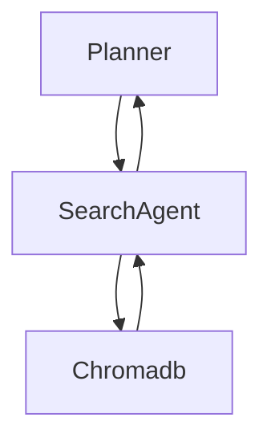
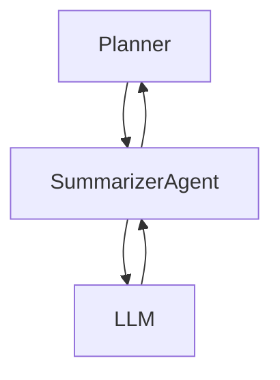
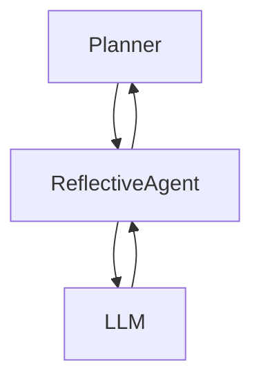
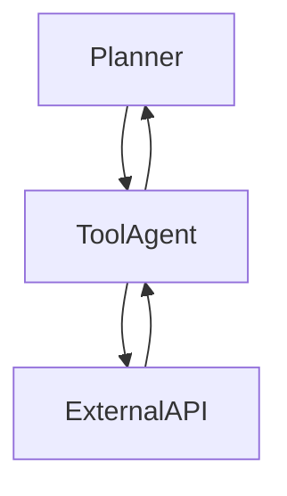
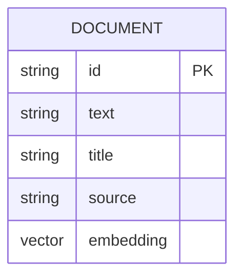
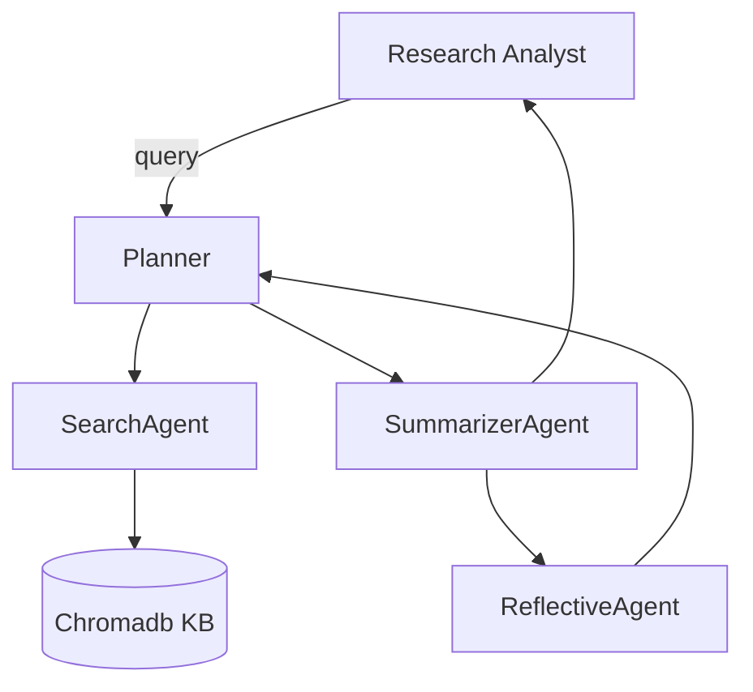
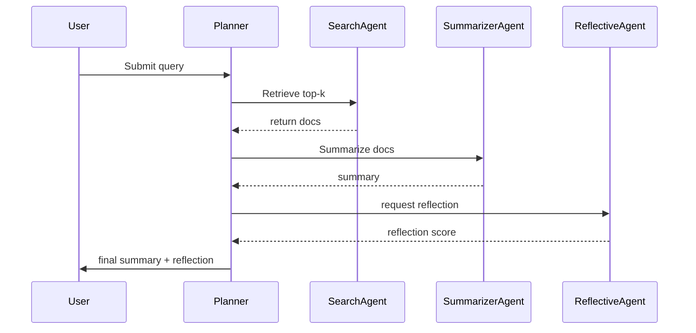

# Math Inquiries — Design Document

## Overview

## This document captures the multi-agent architecture, agent hierarchy, detailed workflows, RAG and reflection design, data model, metrics, diagrams, and responsible-AI considerations for the Math Inquiries project (COMP248).

## 1. Multi-Agent Architecture

### Agent Hierarchy

| Level   | Agent Name       | Responsibility                                                             |
| ------- | ---------------- | -------------------------------------------------------------------------- |
| Planner | Planner          | Receives user queries, routes to workers, composes tasks, manages workflow |
| Worker  | SearchAgent      | Retrieves relevant documents from Chromadb (RAG)                           |
| Worker  | SummarizerAgent  | Summarizes retrieved documents using LLM                                   |
| Worker  | ReflectiveAgent  | Evaluates summary quality, suggests re-runs                                |
| Worker  | ToolAgent (opt.) | Interfaces with external tools/APIs                                        |

**Hierarchy Diagram:**

````mermaid
### Agent Details
| Agent            | LLM/Tool Choice & Justification                                                                 | Workflow Diagram |
|------------------|------------------------------------------------------------------------------------------------|------------------|
| Planner          | No LLM initially (rule-based); may use small LLM for rephrasing. Tool: workflow router.         | See below        |
| SearchAgent      | Chromadb, embedding model: sentence-transformers/all-MiniLM-L6-v2 (fast, small footprint)       | See below        |
| SummarizerAgent  | LLM: OpenAI (gpt-4o/gpt-4) or Llama2 (local, if budget). Best for summarization quality.        | See below        |
| ReflectiveAgent  | LLM-based microchain, evaluates summary (coverage, factuality, redundancy, length).             | See below        |
| ToolAgent        | External APIs (web search, calculators) as needed.                                              | See below        |
---
#### Planner Workflow
```mermaid
#### SearchAgent Workflow
```mermaid
#### SummarizerAgent Workflow
```mermaid
#### ReflectiveAgent Workflow
```mermaid
#### ToolAgent Workflow
```mermaid
---
## 2. RAG (Naïve)
- **Index:** Chromadb vector index storing docs and metadata.
- **Retriever:** top-k by cosine similarity (k=5).
- **Generator:** SummarizerAgent condenses retrieved results.
- **Information Source:** `prototype/data/sample_docs.jsonl` (math-related documents).
**Performance Measures:**
- Recall@k for retrieval (measures if relevant docs are returned)
- ROUGE / BLEU for summarization (if reference summaries exist)
- Factuality/hallucination rate (via question-answer checking)
**Justification:** These are standard measures in RAG and summarization literature.
---
## 3. Reflection Capability
- **Metrics Used:** Coverage (does summary cover all key points?), Redundancy (is info repeated?), Length (conciseness), Factuality (is info correct?).
- **Workflow:** After summarization, ReflectiveAgent computes metrics and a confidence score. If below threshold, Planner triggers another retrieval or expands k.
---
## 4. Routing Capability
- **Routing Logic:** Planner agent uses rule-based logic to assign tasks to workers based on query type and workflow state.
---
## 5. Knowledge Base
- **Primary Store:** Chromadb (embeddings + docs + metadata).
- **Backup:** JSONL file for demo/fallback (`prototype/data/sample_docs.jsonl`).
**Data Model:**
| Field      | Type   | Description                |
|------------|--------|---------------------------|
| id         | str    | Unique document ID         |
| text       | str    | Document content           |
| title      | str    | Document title             |
| source     | str    | Source of document         |
| embedding  | vector | Embedding vector           |
**ER Diagram:**

# Math Inquiries — Design Document

## Overview

This document captures the multi-agent architecture, agent hierarchy, detailed workflows, RAG and reflection design, data model, metrics, diagrams, and responsible-AI considerations for the Math Inquiries project (COMP248).

---

## 1. Multi-Agent Architecture

### Agent Hierarchy

| Level    | Agent Name         | Responsibility                                 |
|----------|--------------------|-----------------------------------------------|
| Planner  | Planner            | Receives user queries, routes to workers, composes tasks, manages workflow |
| Worker   | SearchAgent        | Retrieves relevant documents from Chromadb (RAG) |
| Worker   | SummarizerAgent    | Summarizes retrieved documents using LLM        |
| Worker   | ReflectiveAgent    | Evaluates summary quality, suggests re-runs     |
| Worker   | ToolAgent (opt.)   | Interfaces with external tools/APIs             |

**Hierarchy Diagram:**
```mermaid
erDiagram
  DOCUMENT {
  string id PK
  string text
  string title
  string source
  vector embedding
  }
---
## 6. Diagrams
### UML Component Diagram
```mermaid
### UML Sequence Diagram
```mermaid
---
## 7. Responsible AI: Privacy, Fairness, Explainability
| Principle      | Design Impact                                                                                   |
|----------------|------------------------------------------------------------------------------------------------|
| Privacy        | Minimize PII in KB; remove sensitive content from sources; redact logs.                        |
| Fairness       | Use diverse sources; avoid bias in sample docs and LLM prompts.                                |
| Explainability | Provide provenance (source, doc_id) for every chunk; log agent decisions for review.           |
| Responsible AI | Use only open, non-sensitive data; document all design choices and limitations.                |
---
## 8. Files Referenced
- `prototype/agents.py` — agent implementations (simple prototypes)
- `prototype/db.py` — chromadb interactions
- `prototype/app.py` — Streamlit demo
---
End of revised design document.
graph TD
  Planner --> SearchAgent
  Planner --> SummarizerAgent
  Planner --> ReflectiveAgent
  Planner --> ToolAgent
````

---

### Agent Details

| Agent           | LLM/Tool Choice & Justification                                                           | Workflow Diagram |
| --------------- | ----------------------------------------------------------------------------------------- | ---------------- |
| Planner         | No LLM initially (rule-based); may use small LLM for rephrasing. Tool: workflow router.   | See below        |
| SearchAgent     | Chromadb, embedding model: sentence-transformers/all-MiniLM-L6-v2 (fast, small footprint) | See below        |
| SummarizerAgent | LLM: OpenAI (gpt-4o/gpt-4) or Llama2 (local, if budget). Best for summarization quality.  | See below        |
| ReflectiveAgent | LLM-based microchain, evaluates summary (coverage, factuality, redundancy, length).       | See below        |
| ToolAgent       | External APIs (web search, calculators) as needed.                                        | See below        |

---

#### Planner Workflow

```mermaid
flowchart TD
  UserQuery --> Planner
  Planner -->|route| SearchAgent
  Planner -->|route| SummarizerAgent
  Planner -->|route| ReflectiveAgent
  Planner -->|route| ToolAgent
```

#### SearchAgent Workflow



#### SummarizerAgent Workflow



#### ReflectiveAgent Workflow



#### ToolAgent Workflow



---

## 2. RAG (Naïve)

- **Index:** Chromadb vector index storing docs and metadata.
- **Retriever:** top-k by cosine similarity (k=5).
- **Generator:** SummarizerAgent condenses retrieved results.
- **Information Source:** `prototype/data/sample_docs.jsonl` (math-related documents).

**Performance Measures:**

- Recall@k for retrieval (measures if relevant docs are returned)
- ROUGE / BLEU for summarization (if reference summaries exist)
- Factuality/hallucination rate (via question-answer checking)

**Justification:** These are standard measures in RAG and summarization literature.

---

## 3. Reflection Capability

- **Metrics Used:** Coverage (does summary cover all key points?), Redundancy (is info repeated?), Length (conciseness), Factuality (is info correct?).
- **Workflow:** After summarization, ReflectiveAgent computes metrics and a confidence score. If below threshold, Planner triggers another retrieval or expands k.

---

## 4. Routing Capability

- **Routing Logic:** Planner agent uses rule-based logic to assign tasks to workers based on query type and workflow state.

---

## 5. Knowledge Base

- **Primary Store:** Chromadb (embeddings + docs + metadata).
- **Backup:** JSONL file for demo/fallback (`prototype/data/sample_docs.jsonl`).

**Data Model:**

| Field     | Type   | Description        |
| --------- | ------ | ------------------ |
| id        | str    | Unique document ID |
| text      | str    | Document content   |
| title     | str    | Document title     |
| source    | str    | Source of document |
| embedding | vector | Embedding vector   |

**ER Diagram:**



---

## 6. Diagrams

### UML Component Diagram



### UML Sequence Diagram



---

## 7. Responsible AI: Privacy, Fairness, Explainability

| Principle      | Design Impact                                                                        |
| -------------- | ------------------------------------------------------------------------------------ |
| Privacy        | Minimize PII in KB; remove sensitive content from sources; redact logs.              |
| Fairness       | Use diverse sources; avoid bias in sample docs and LLM prompts.                      |
| Explainability | Provide provenance (source, doc_id) for every chunk; log agent decisions for review. |
| Responsible AI | Use only open, non-sensitive data; document all design choices and limitations.      |

---

## 8. Files Referenced

- `prototype/agents.py` — agent implementations (simple prototypes)
- `prototype/db.py` — chromadb interactions
- `prototype/app.py` — Streamlit demo

---

End of revised design document.
