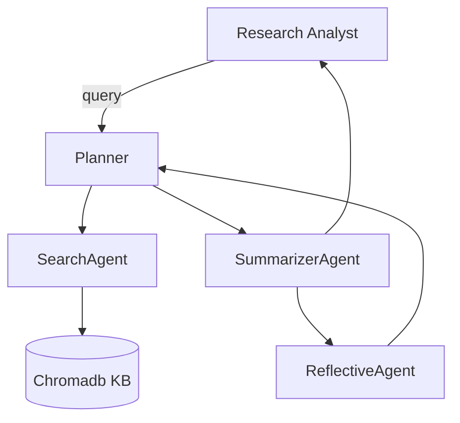
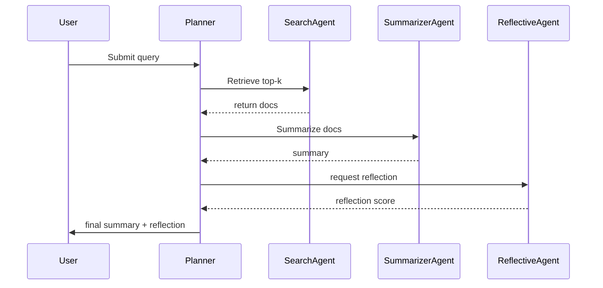

# Math Inquiries — Design Document

## Overview

This document captures the multi-agent architecture, UML component and interaction diagrams, workflows, RAG design, reflection design, data model, metrics, and responsible-AI considerations for the Math Inquiries project (COMP248).

## Agents (max 5)

- Planner (level 1): routes queries to workers, composes tasks.
- SearchAgent (worker): performs retrieval from the knowledge base (Chromadb) — naive RAG.
- SummarizerAgent (worker): uses an LLM to summarize retrieved docs.
- ReflectiveAgent (worker): introspective agent that scores outputs, suggests re-runs.
- ToolAgent (optional): interfaces with external tools/APIs (web search, calculators).

For each agent we list responsibility, suggested LLM, and tools:

- Planner: no LLM needed initially (simple rule-based); may use light LLM for rephrasing. Tools: workflow router.
- SearchAgent: uses Chromadb; embedding model: sentence-transformers/all-MiniLM-L6-v2; justification: fast embeddings and small footprint.
- SummarizerAgent: LLM = OpenAI (gpt-4o / gpt-4) or local LLM (Llama2) depending on budget. Justification: best quality summarization.
- ReflectiveAgent: LLM-based microchain that evaluates summary quality against heuristics (coverage, factuality) and returns a reflection score.

## RAG (Naïve)

- Index: Chromadb vector index storing docs and metadata.
- Retriever: top-k by cosine similarity (k=5).
- Generator: SummarizerAgent condenses retrieved results.

Suggested performance measures:

- Recall@k for retrieval
- ROUGE / BLEU for summarization (where reference summaries exist)
- Factuality / hallucination rate using question-answer checking

## Knowledge Base

- Primary store: Chromadb (embeddings + docs + metadata).
- Backup: small JSONL file for demo/fallback (`prototype/data/sample_docs.jsonl`).

Data model (document record):

- id: str
- text: str
- title: str
- source: str
- embedding: vector

## Reflection workflow

1. After summarization, ReflectiveAgent computes metrics (coverage, redundancy, length) and a confidence score.
2. If below threshold, Planner triggers another retrieval or expands k.

## UML Component Diagram (Mermaid)

## Sequence Diagram (Mermaid)

## Privacy, Fairness, Explainability

- Minimize PII in knowledge base; remove sensitive content from sample sources.
- Provide provenance: store `source` and `doc_id` for every chunk returned.
- Logging: keep limited logs for debugging and peer review; redact sensitive content.

## Files referenced in this design

- `prototype/agents.py` — agent implementations (simple prototypes)
- `prototype/db.py` — chromadb interactions
- `prototype/app.py` — Streamlit demo

---
End of design document.
