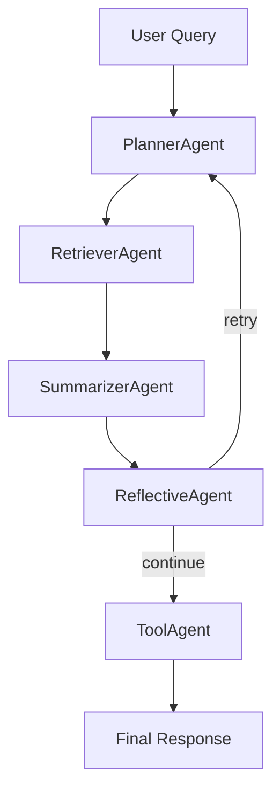
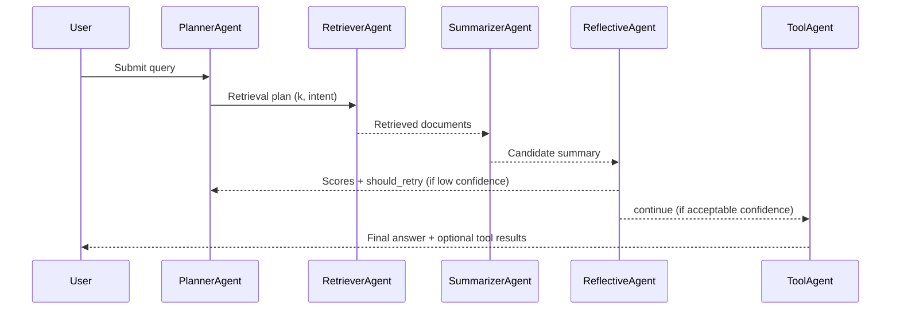

# Math Inquiries - Design Document

## Overview

This design describes the current runtime system implemented in the prototype codebase. The architecture is a 5-agent LangGraph workflow with conditional retry and metadata instrumentation.

## 1. Multi-Agent Architecture

### Agent Hierarchy

| Level   | Runtime Name    | Responsibility                                                         |
| ------- | --------------- | ---------------------------------------------------------------------- |
| Planner | PlannerAgent    | Classify query intent, select retrieval parameters, and set tool hints |
| Worker  | RetrieverAgent  | Retrieve top-k relevant chunks from ChromaDB                           |
| Worker  | SummarizerAgent | Generate answer from retrieved context (LLM with fallback)             |
| Worker  | ReflectiveAgent | Score answer quality and produce retry signal                          |
| Worker  | ToolAgent       | Execute selected tools through tool registry                           |

The system uses 5 agents total, satisfying the project limit.

### Runtime Flow (Exact)

Routing behavior (implemented in workflow graph):

- retry when confidence is below threshold and max iterations not reached
- continue otherwise

## 2. Framework and Orchestration

- Framework: LangGraph StateGraph
- Entry point: PlannerAgent
- Deterministic edges: planner -> retriever -> summarizer -> reflector
- Conditional edge: reflector -> planner (retry) or tool_agent (continue)
- Exit edge: tool_agent -> END

This logic is implemented in prototype/workflow/graph.py.

## 3. Retrieval and Knowledge Base (RAG)

- Vector store: ChromaDB (persistent local database)
- Retriever: embedding-based top-k retrieval through RetrieverAgent
- Embedding model: all-MiniLM-L6-v2
- Sources:
  - prototype/data/sample_docs.jsonl
  - local PDFs in prototype/data

Chroma ingestion pipeline:

1. Load docs
2. Chunk docs
3. Embed chunks
4. Store in Chroma collection

## 4. Reflection Capability (Exact Runtime Metrics)

ReflectiveAgent returns this runtime schema:

- factual_correctness (0 to 1)
- completeness (0 to 1)
- relevance (0 to 1)
- confidence (0 to 1)
- feedback_text (short feedback)
- evaluation_source (llm or fallback)
- should_retry (boolean)
- notes (list for UI display)

Confidence is computed as a weighted aggregate:

- 0.45 \* factual_correctness
- 0.30 \* completeness
- 0.25 \* relevance

Retry decision:

- should_retry = confidence < CONFIDENCE_THRESHOLD

## 5. Tooling Design

ToolAgent uses a registry pattern.

Built-in tools:

- calculator (Sympy)
- web_search (SerpAPI with DuckDuckGo fallback)

Selection strategy:

1. Planner-requested tools (if any)
2. Query-intent selectors from the registry

## 6. Metadata Instrumentation

Runtime state includes metadata for observability:

- agent_sequence
- timestamps
- decisions
- trace

This metadata is displayed in Streamlit under the Metadata tab and used in CLI output.

## 7. UML Sequence Diagram (Aligned)

## 8. Responsible AI Notes

- Privacy: use non-sensitive educational content
- Explainability: expose sources, metrics, and decision metadata
- Safety: bounded iteration loop prevents infinite retries

## 9. Source of Truth

The following files are authoritative for runtime behavior:

- prototype/workflow/graph.py
- prototype/agents/planner.py
- prototype/agents/retriever.py
- prototype/agents/summarizer.py
- prototype/agents/reflective_agent.py
- prototype/agents/tool_agent.py
- prototype/tools/builtin_tools.py
- prototype/chroma_setup.py
- prototype/ingest.py
